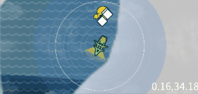
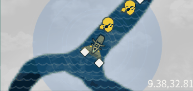
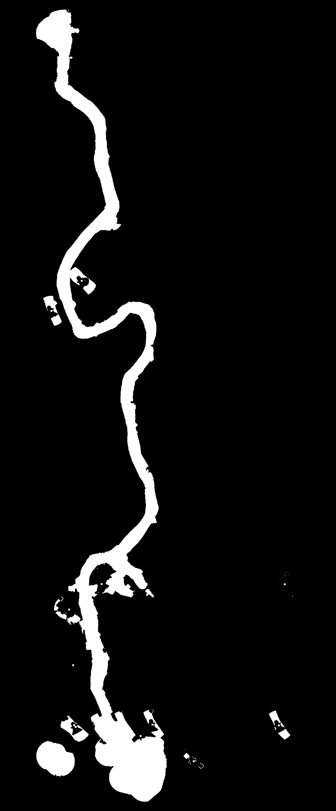

# UWO-Bot — an autonomous agent for *Uncharted Waters Origin*

A Python bot that plays the mobile game **Uncharted Waters Origin** on a real
Android phone. It sees only what a player sees — screen captures mirrored over
`scrcpy` — perceives the game through a tiered vision stack, and drives the game
through ADB touch input. The long-term goal is a self-growing trading company;
today its strongest capability is **autonomous sea & river exploration**.

## 🧭 Exploration (the heart of the project)

The bot navigates open sea, winds down rivers, and hugs coastlines **without a
map of its own** — it reads the in-game mini-map each tick, estimates the ship's
heading with a trained CNN, traces the nearest river/coast bank, and steers a
shore-hugging path. That lets it descend the **Nile from Cairo to Lake Victoria
and sail back** with almost no thrashing.

*Live mini-map (49 consecutive ticks): the bot reaches the Nile's equatorial-lake
terminal (lat ≈ −1.27, the southern turnaround of a Cairo → Lake Victoria → Cairo
round trip) and makes a clean U-turn — the white diamonds trace its path. Full
round trip: 734 ticks / 4 course-flips / zero thrash on the current substrate.*

It also handles **dead ends without a map**: at a Y-junction it probes into the
dead-end tip, reverses out, and commits to the other branch.

*A Y-junction on the Nile (37 consecutive ticks): the ship pushes up into the
dead-end tip, reverses out when it stops making progress, and takes the other
branch — Trémaux-style dead-end handling driven purely by the traced bank.*

How it works, in layers:
- **L1 heading** — a 220K-param CNN reads ship pose from the mini-map sprite (robust to occlusion).
- **L2 segmentation** — water/land from the mini-map.
- **L3–L4 tactical** — trace the hugging-side bank to the frame-edge exit, offset it inward, and pick reflex/tactical steer points; PID rudder control.
- **L5 mission** — point-to-point and river-explore goals.

Design detail: `docs/loop_navigation_design.md`, `docs/navigation_models_status.md`.

## What else it does
- **Tiered perception** — family CNN + learned screen fingerprints + OmniParser (YOLO) + OCR, with Claude Vision / Moondream VLMs as cached fallbacks.
- **World-map localization** — reads lat/lon, pan/zoom, village support.
- **Ports & trading primitives** — enter buildings, read markets, buy/sell (see limitations).
- **FSM + recovery** — state classification, plan/flow completeness, escalation.

## Running it

Prereqs: an Android phone on ADB (`adb devices`), `scrcpy` for display, Python
deps (`pip install -r requirements.txt`), and model weights
(`python -m vision.omniparser --download`; CNN weights live in `data/models/`).
`vision/models/` and `data/sessions/` are git-ignored (downloaded/produced at runtime).

| Tool | Command | Purpose |
|---|---|---|
| **Live navigation** | `python -m tools.run_ai_nav_live --tactical loop --side port --max-ticks 800` | drive a real voyage on the phone |
| **Evaluate a voyage** | `python -m tools.evaluate_voyage data/sessions/<session>/` | PASS/WARN/FAIL vs the canonical Nile reference |
| **Inspect frames + trace** | `python -m tools.tick_viewer <session>` | step through ticks, jump to issue ticks |
| **Offline sim** | `python -m tools.sim_ai_nav` · `python -m tools.run_sim_voyage` | replay perception/steering without the phone |
| **Regression scenarios** | `python -m pytest tests/tactical_scenarios/` | perceive-from-frames replays of hard cases |
| **Capture a voyage** | `python -m tools.capture_voyage` · `python -m tools.sail_capture` | record frames + trace for training/eval |
| **Autonomous grow loop** | `python run_task.py tasks/self_grow.yaml` | sail-and-trade loop *(early — see limits)* |
| **Interactive CLI** | `python run.py` | manual commands: goto, sail, trade, explore |
| **Train models** | `python -m tools.train_heading_cnn` · `train_family_classifier` · `train_shoreline_classifier` · `train_minimap_detector` | (re)train the perception CNNs |
| **Calibrate** | `python -m tools.calibrate_steering` · `calibrate_latlon` · `world_map_calibrate` | steering rate, lat/lon affine, world-map anchors |

(There are ~130 scripts under `tools/` — the table lists the day-to-day ones.)

## What it does **not** do well yet

Honest state — the redesign in `docs/refactor_plan_perceive_flow_fsm.md` targets these:

- **Trading is fragile.** The market-page reader mis-parses the tile grid, so
  autonomous buy/sell often fail ("no goods available", empty-basket sell). Nav
  works; profitable trading does not yet.
- **Absolute screen coordinates are brittle.** They shift with the phone's notch
  orientation and game-UI updates. A rotation-lock guard mitigates it; the real
  fix (a learned UI-slot detector) is planned.
- **Perception composes by priority order, not confidence.** A strong CNN verdict
  can be overridden by a weak fuzzy string-match (e.g. a port misread as a
  village), which can stall recovery.
- **Dialog/overlay handling is ad-hoc**, especially non-standard popups (daily
  news) shown over another screen.
- **OmniParser is slow here (~8 s/call, likely CPU)** — the structural-detection
  tier is a bottleneck.
- **Combat** is essentially not started.

## Docs
- Architecture review: `docs/architecture_review_perceive_flows_2026-08.md`
- Refactor plan: `docs/refactor_plan_perceive_flow_fsm.md`
- Design diagrams (Mermaid): `docs/new_design_diagrams.md`
- Project rules & knowledge map: `CLAUDE.md`

