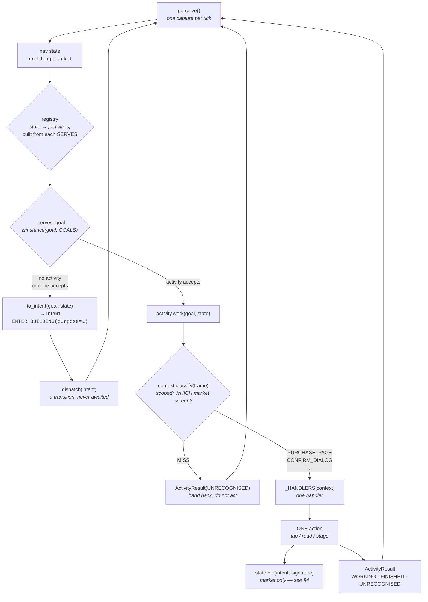
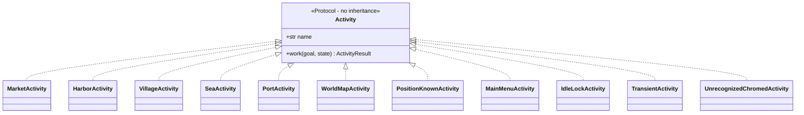
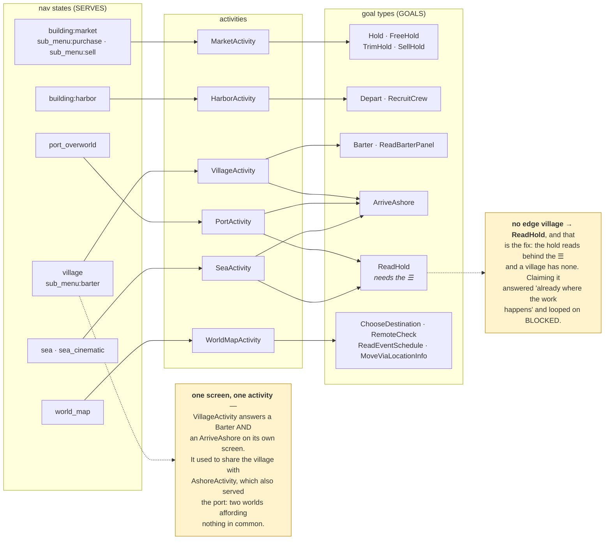
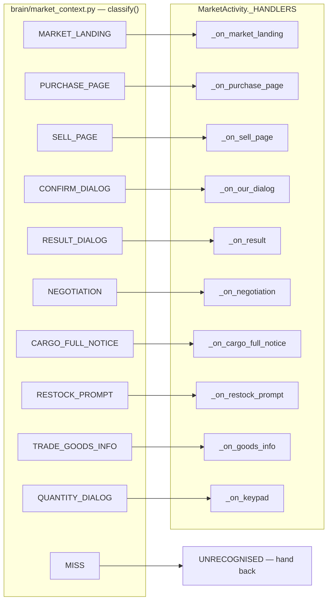
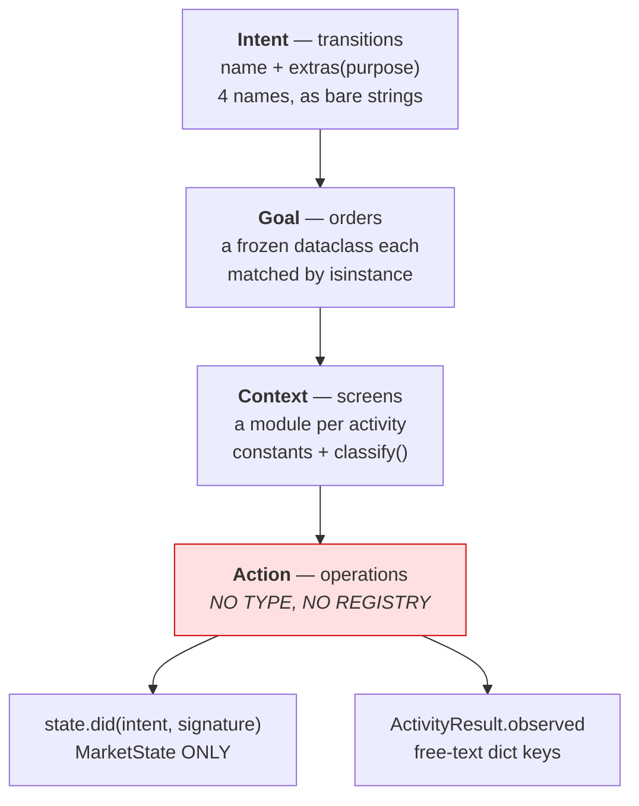
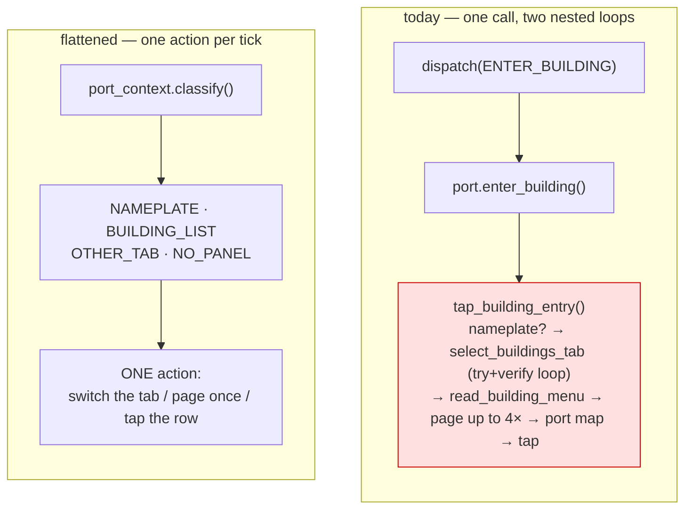
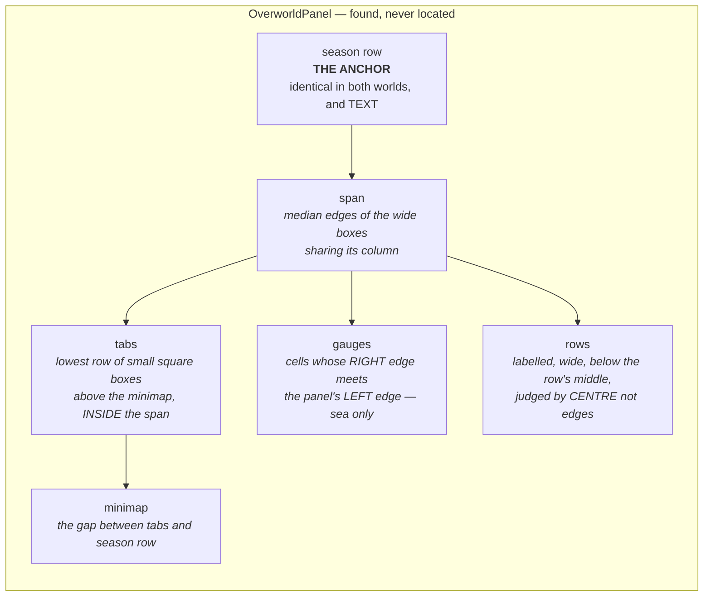

# The dispatcher, activities and contexts — as they actually are (2026-09-11)

Read off the code, not the intent: `brain/dispatcher.py`, `brain/run_goal.py`,
`brain/activities/*.py`, `brain/*_context.py`. Where something is missing this says so rather
than drawing what ought to be there.

---

## 1. One tick, end to end

Four routings, each answering a different question.



**The four questions, and who answers each**

| question | answered by | mechanism |
|---|---|---|
| where am I? | `classify_nav_state` | family CNN → fingerprints |
| who works here? | the registry | built from each activity's `SERVES` |
| can they do this order? | `_serves_goal` | `isinstance(goal, tuple(GOALS))` |
| which screen of theirs is this? | the activity's context module | `classify()` → a constant, or `MISS` |

---

## 2. What an activity declares

There is **no base class**. `Activity` is a `Protocol` requiring only `name` and `work`;
everything else is optional class attributes read with `getattr` and a default.



Everything else is an optional class attribute, read with `getattr` and a default — so an
activity that declares nothing still runs:

| attribute | what it declares | who reads it |
|---|---|---|
| `SERVES` | which nav STATES it works in | `default_activities()` builds the registry from it |
| `GOALS` | which ORDERS it will fill | `_serves_goal`, by isinstance |
| `CAN_START` | intents it may begin from here | the dispatcher, before dispatching one |
| `LEADS_TO` | where each of those intents lands | the dispatcher, to predict the next state |
| `CONTEXT_STATES` | the screens it owns inside itself | its own context module |
| `CLEARS_SCREEN` | FINISHED means the screen went away | the dispatcher's post-check |

**`GOALS` absent and `GOALS` empty mean the same thing, and it is load-bearing.** Declaring
none marks an activity as *state-clearing* — the lock, a full-screen notice, an unnameable
chromed screen — so it absorbs every goal and ignores it. `VillageActivity` had none, so it
swallowed `ClearOfTheVillage` and answered BLOCKED instead of letting it route to a Back.

---

## 3. A state may have several activities; a goal picks between them



Five activities are missing from that picture, and they are missing for two different
reasons.

**Four CLEAR a screen rather than serving a world.** `MainMenuActivity`, `IdleLockActivity`,
`TransientActivity` and `UnrecognizedChromedActivity` each own one state, declare no `GOALS`
at all, and so absorb every goal and ignore it (§2). Each has a repertoire of exactly one
action and an UNKNOWN destination, which is why each finishes without reporting where the bot
now is: the dispatcher re-perceives anyway, and a remembered destination is a belief.

**One serves every world at once.** `PositionKnownActivity` declares
`SERVES = WORKABLE` — all fifteen states the task runner can be asked about — and
`GOALS = (KnowWhereWeAre,)`. Drawing it would add an edge from every state and say nothing,
so it is left out above. What it does: a fresh run ticks the dispatcher until perception
lands on a workable state, the clearing activities peeling one layer per tick until it does.
`establish_position()` runs that before any work order is accepted.

It declares `CAN_START = ()` deliberately, and the comment explains why: affordances are
UNIONED across the activities serving a world, so one non-empty entry here would afford that
transition in all fifteen worlds at once.

Note what its `work()` does, which is nothing — it logs and returns FINISHED carrying what
perceive already produced. `KnowWhereWeAre` is satisfied exactly when the state is in
`WORKABLE`, so this is a PREDICATE wearing an activity's clothes. `PortActivity`'s answer to `ArriveAshore` is the
same shape, and both would disappear the day goals carry their own done-condition
(`docs/the_plan_is_a_checklist.md`).

**Buying is not a function the dispatcher knows.** It is the goal type `Hold` plus the
purchase page being in front of you. The dispatcher only ever calls `work(goal, state)`.

---

## 4. Inside an activity — context to handler



Every context has a handler, and the table is the whole of the routing: no `if` chain, no
fallthrough. Two of the ten — `TRADE_GOODS_INFO` and `QUANTITY_DIALOG` — belong to the trim
alone; every other goal answers UNRECOGNISED on them, which is what deliberately opening a
dialog looks like from the outside.

Two rules the module enforces, both paid for:

- **Classify by structure, never by wording.** `OVERFLOW_PROMPT` in `village_context` once
  keyed on "overflow" / "exceeds" / "cargo is full" — three phrases the game has never drawn.
  It says *Insufficient Empty Space*, so `_on_overflow` was unreachable and every overflow met
  was discarded in silence, 360 units at San Village on 2026-09-05. It now asks
  `vision.region_detectors.overflow_cards`, which reads the card's two strips.
- **Innermost first.** The discard notice opens OVER the overflow card, so both are on screen
  and only the top one is live. Classification checks the notice before the card underneath.

---

## 5. What is missing: an action layer

The four layers above are typed and routed. Below the handler there is nothing.



`MarketState.did()` / `.landed()` / `.repeated()` is the only action memory in the codebase —
used by `market.py`, `market_buy.py`, `market_sell.py` and `market_trim.py`. The village,
world map, sea and harbour have none.

It is also a **single slot describing the previous tick**, which is why bespoke fields keep
appearing beside it whenever something must survive a dialog:

| field | why it exists |
|---|---|
| `awaiting_credit` | `did` was overwritten by every dialog handler between Purchase and the result card |
| `shelf_before_cart` | the shelf must be remembered from BEFORE staging, two ticks earlier |
| `_funded_rounds` | the panel must be read before the overflow card covers it |

Three instances of one shape: *what I did, kept until the tick that needs it*. An action layer
with a lifecycle would carry all three; today each is hand-rolled, and each arrived only after
the run it cost.

---

## 6. The port overworld got its activity — what landed, and what did not

**Status: BUILT 2026-09-11** on branch `port_activity`. This section was the argument for the
change; it now records what the change was and what it deliberately left alone.

### The test an activity should pass

**It is named by a state the classifier emits.** Ten of the eleven do: `market`, `harbor`,
`village`, `sea`, `world_map`, `main_menu`, `idle_lock`, `transient`, the unnameable chromed
screen, and now `port_overworld`. There was no `ashore` state, and there is still no
`position_known` one.

### What was wrong

`AshoreActivity` served the port overworld AND the village. A port has the ☰, the globe and
the building list; a village is a chromed screen with a back arrow and no ☰, no globe. That
forced the only per-world capability declarations in the codebase:

```python
CAN_START = {"port_overworld": ("OPEN_WORLD_MAP", "ENTER_BUILDING"),
             "village":        ("EXIT_BUILDING",)}
```

**An activity that must ask which world it woke up in before it can say what it can do is two
activities sharing a name** (user).

It cost a run. `ReadHold` reads the fleet panel from behind the ☰, and `GOALS` was not split
per world, so routing answered *already where the work happens* at a village, handed the read
to an activity that could not do it, and took BLOCKED back on every tick. Live 2026-08-29 at
Svear that was dead on tick 2, before touching the game.

### What landed

1. **`PortActivity`** serves `port_overworld` alone, with flat `CAN_START` and `LEADS_TO`
   again. Affordances per world are byte-identical to before.
2. **`VillageActivity` answers `ArriveAshore`** on its own screen — the activity that owns a
   screen is the one that says you have arrived on it. It needed no new capabilities; it
   already declared `EXIT_BUILDING` and its destination.
3. **Routing asks per goal, not per activity.** `ArriveAshore` is satisfied at a port or a
   village; `ReadHold` at a port or at sea. A village now routes a `ReadHold` OUT to the sea,
   where the hamburger is. That is the wedge above, closed without a special case.
4. **`brain/port_context.py`** classifies the port screen: nameplate, building list, other
   tab, nothing readable. Two tabs can look right at once — the CONTENT lies (a quest
   objective containing "market" at Bordeaux) and so does the HIGHLIGHT (the location pin
   lights warm and is not in the exclusive group), so the list needs two exact names, not one.
5. **`actions/port_panel.py`** holds the port's work, moved out of `actions/sail_actions.py`
   where it had accumulated among the SAILING primitives for want of an owner.
6. **`brain/intents.dispatch` names the world, not the reader.** It used to
   `from actions.sail_actions import tap_building_entry`; it now asks
   `brain.activities.port.enter_building` (user: *"dispatcher should not know about tap
   building entry, that is the PortActivity's responsibility"*).

`selected_tab_index` and the luminance constants stayed in `sail_actions`: the world map has a
tab strip too and reads it the same way. Moving them with the port broke 44 tests, which is
the evidence that they are shared rather than port-specific.

### What did NOT land, and why

**`tap_building_entry` is still a sub-loop.** It claims to tap ONCE and, in that one call,
checks for a nameplate, selects the Buildings tab (trying each candidate and verifying by
re-reading the list), reads the menu, pages it up to four times, opens the port map, and taps.



Flattening it is blocked on TWO dispatcher guards, and both are about the same blind spot:

| guard | why it fires | where |
|---|---|---|
| in-flight | `_screen_signature` returns the FAMILY verdict when it is ≥0.90 sure, and a port reads 0.9998 — so a tab switch or a page leaves it identical and the next tick reads the tap as lost | `brain/dispatcher.py` |
| stall | the step tuple is (state, goal, intent, statuses, observed) and none of those move either; `_MAX_RETRIES` is 3 | `brain/run_goal.py` |

Neither needs a new concept. Both already carry small tables of per-intent knowledge
(`_INTENT_SETTLE_S`, `_RETRY_ONCE_IF_UNCHANGED`), and what is missing is a progress marker in
the in-flight key and the stall tuple, so a transition that reports real progress is not read
as one that never landed. There is also a cost to watch: `_INTENT_SETTLE_S` charges
ENTER_BUILDING 20s, so a naive flattening would wait that per page.

### The one class that is still a predicate

`PositionKnownActivity` serves all fifteen workable states and its `work()` takes no action.
`KnowWhereWeAre` is true exactly when the state is in `WORKABLE`, which is decidable from the
frame already perceived. `PortActivity`'s answer to `ArriveAshore` is the same shape. Give
goals a satisfied-by check (`docs/the_plan_is_a_checklist.md`, whose predicate half is still
open) and neither needs to be registered at all.

---

## 7. The overworld right panel

**Status: BUILT 2026-09-11.** `vision/region_detectors/overworld_panel.py`.

The port overworld and the sea carry the SAME element, in the same place, with the same parts
in the same order (user: *"a very distinct UI element shared by both sea and port overworld,
with different contents"*). Measured on two frames of
`data/sessions/trace_barter_cmd_2026-09-11T13-47-33`:

| part | port (frame 0000, London) | sea (frame 0588, Atlantic) |
|---|---|---|
| gauge strip | none | tide `HW` · speed `27.6` · wind `4` · current `1` |
| tab strip | Tasks · Buildings · Players · pin | Tasks · Ports · fleets · ships |
| minimap | the town, GLOBE bottom-right | the sea, lat/long bottom-right |
| season row | ☀ Summer Aug 00:10 | ☀ Summer Aug Night |
| the list | Harbor, Market, Shipyard… | Berber Village, Las Palmas… |

The four tab centres agree to within two pixels across both worlds, and the body spans
x[1862, 2267] in both. Only the pictures on the tabs differ.



**It replaced five encodings that could not see each other**, each learned from a live wedge
and written where it was learned:

| what | where | what was wrong with it |
|---|---|---|
| `CHROME_RIGHT_PANEL_REGION` | `config/settings.py` | (2050,100,2400,420) — begins 188px right of the panel, runs 133px past its end |
| `RIGHT_EDGE` | `vision/state_fingerprints_data.py` | the same box, normalised, calibrated separately to different numbers |
| `_tab_strip_band` | `actions/sail_actions.py` | the strip alone, offset from the minimap crop |
| `BUILDING_MENU_REGION` | `config/settings.py` | the list alone |
| `panels.detect_right_panel` | `vision/region_detectors/panels.py` | a DIFFERENT thing (Cart, Hire, City Info) sharing the name |

Two live failures are this element being taken for something else: on 2026-09-01
ENTER_BUILDING at sea "cycled the minimap's four tab icons for minutes", because the strip
exists in both worlds and the code knew only the port's; and the obstruction classifier has
read the port's panel as a POPUP.

**No absolute position remains in the module** (user: *"I hope to avoid the hardcoded bbox,
especially for the x and y starting point"*). What is left are ratios of the panel's own
measured width and one seam tolerance. A test shifts the whole panel 110px and expects the
same reading, because the game re-bakes its camera-cutout offset per screen.

Three faults the real frames caught while building it, each worth keeping:

- **The season row is the CELLS on that line, not everything crossing it.** The minimap is one
  tall box spanning the line, so sweeping it in made the row 300px tall, which put the tab
  search above the wrong line and returned the ACCOUNT BAR as the strip.
- **A tab is INSIDE the span, not merely centred near it.** The sea's gauge cells are the same
  size and shape and sit flush against the edge; a centre-plus-margin test separated them by
  two pixels, which is not a separation.
- **A row is judged by its CENTRE, not its edges.** `Bureau` at London comes back as
  x[1860,2351] because the parse merged it with the coordinate footer, 84px past the panel.
  Judging by an edge drops a building the bot can walk into
  (`memory/a-box-bigger-than-its-thing`).

### Who asks it

- `vision/chrome_via_omniparser.py` — `has_right_panel` is the panel being FOUND, with the old
  count kept as a floor. The dangerous direction is the false negative that reads an overworld
  as a chromed screen, and OR-ing can only add answers.
- `brain/port_context.py` — the tab strip. Its points are identical to the older reader on
  both frames and `selected_tab_index` agrees on both, so this changed no behaviour.
- `vision/sea_hud.py` — the speed tile, and ONLY through the panel (user: *"they exist at the
  same time"*). That deleted four offsets from `MINIMAP_CROP` and an absolute fallback that
  measured (1915,243,1975,283) against a minimap at x[1864,2266) — inside the map disc. The
  module's own comment records that failing live on 2026-08-24. **The cell is found by its
  CONTENT**: the speed is the only decimal in the strip, so the reader scans the cells rather
  than trusting `gauges[1]`, which would be a calibrated coordinate in another hat.

Still outstanding: a seventh copy of the minimap detection lives inline in
`tools/run_ai_nav_live.py`, which recalibrates `MINIMAP_CROP` at startup.

See `docs/market_as_contexts.md` for the context pattern's own design note.
