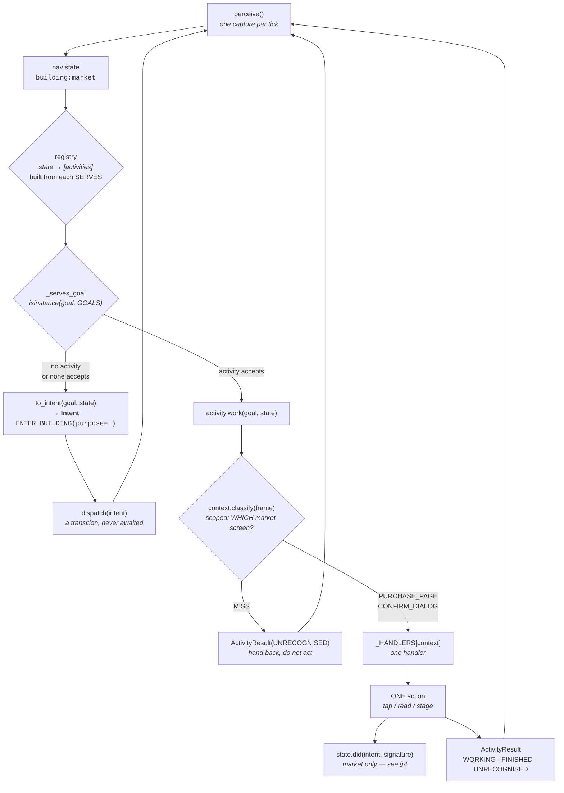
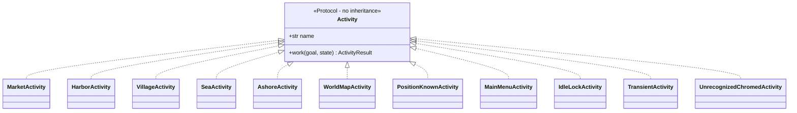
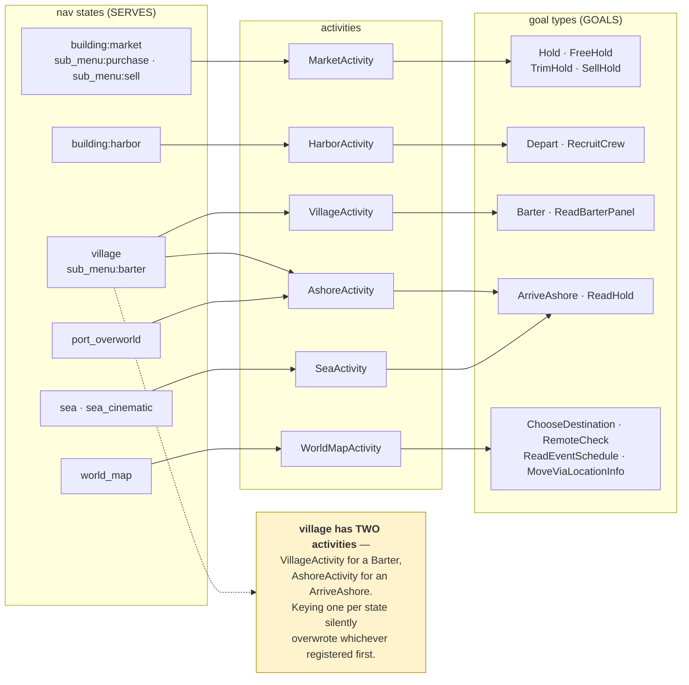
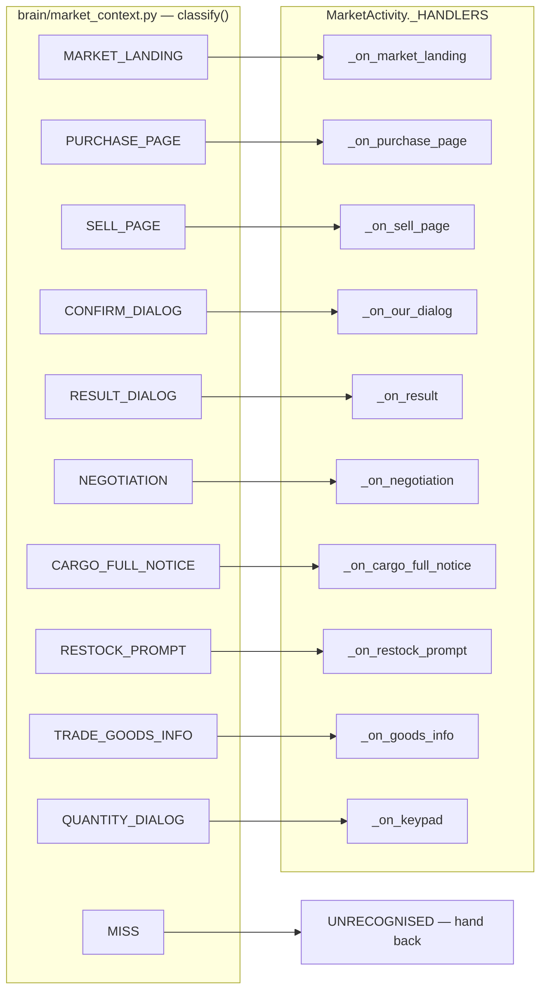
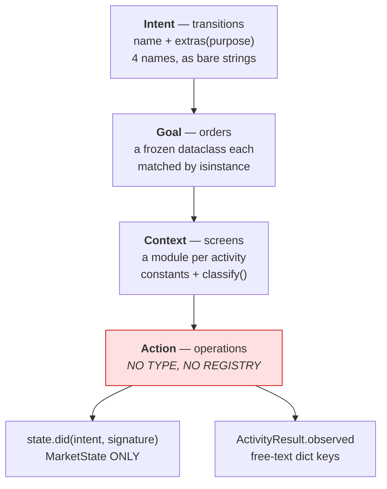
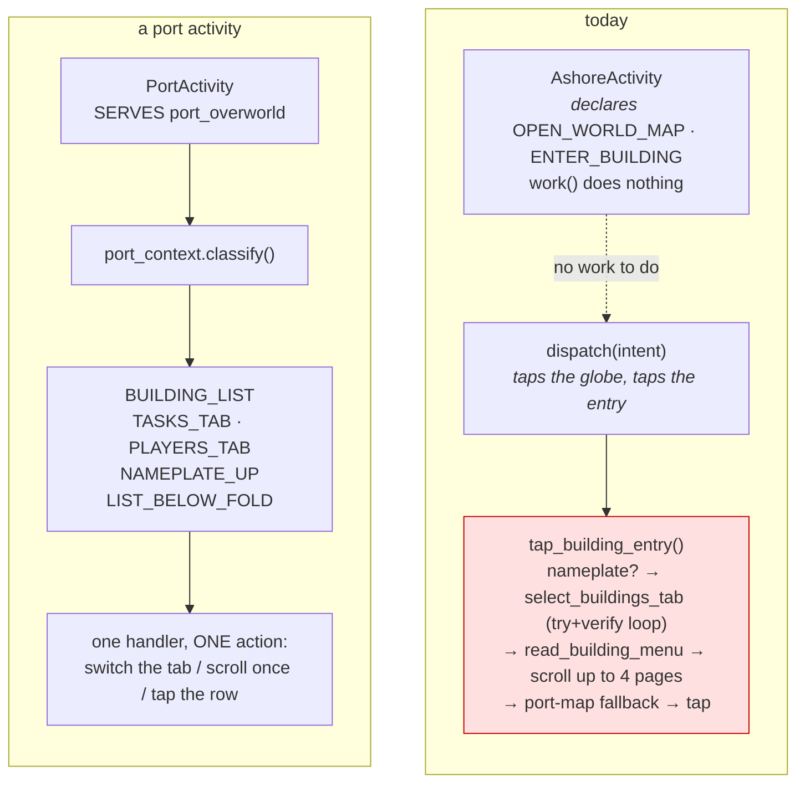

# The dispatcher, activities and contexts — as they actually are (2026-09-11)

Read off the code, not the intent: `brain/dispatcher.py`, `brain/run_goal.py`,
`brain/activities/*.py`, `brain/*_context.py`. Where something is missing this says so rather
than drawing what ought to be there.

---

## 1. One tick, end to end

Four routings, each answering a different question.

**The four questions, and who answers each**

| question | answered by | mechanism |
|---|---|---|
| where am I? | `classify_nav_state` | family CNN → fingerprints |
| who works here? | the registry | built from each activity's `SERVES` |
| can they do this order? | `_serves_goal` | `isinstance(goal, tuple(GOALS))` |
| which screen of theirs is this? | the activity's context module | `classify()` → a constant, or `MISS` |

---

## 2. What an activity declares

There is **no base class**. `Activity` is a `Protocol` requiring only `name` and `work`;
everything else is optional class attributes read with `getattr` and a default.

Everything else is an optional class attribute, read with `getattr` and a default — so an
activity that declares nothing still runs:

| attribute | what it declares | who reads it |
|---|---|---|
| `SERVES` | which nav STATES it works in | `default_activities()` builds the registry from it |
| `GOALS` | which ORDERS it will fill | `_serves_goal`, by isinstance |
| `CAN_START` | intents it may begin from here | the dispatcher, before dispatching one |
| `LEADS_TO` | where each of those intents lands | the dispatcher, to predict the next state |
| `CONTEXT_STATES` | the screens it owns inside itself | its own context module |
| `CLEARS_SCREEN` | FINISHED means the screen went away | the dispatcher's post-check |

**`GOALS` absent and `GOALS` empty mean the same thing, and it is load-bearing.** Declaring
none marks an activity as *state-clearing* — the lock, a full-screen notice, an unnameable
chromed screen — so it absorbs every goal and ignores it. `VillageActivity` had none, so it
swallowed `ClearOfTheVillage` and answered BLOCKED instead of letting it route to a Back.

---

## 3. A state may have several activities; a goal picks between them

Five activities are missing from that picture, and they are missing for two different
reasons.

**Four CLEAR a screen rather than serving a world.** `MainMenuActivity`, `IdleLockActivity`,
`TransientActivity` and `UnrecognizedChromedActivity` each own one state, declare no `GOALS`
at all, and so absorb every goal and ignore it (§2). Each has a repertoire of exactly one
action and an UNKNOWN destination, which is why each finishes without reporting where the bot
now is: the dispatcher re-perceives anyway, and a remembered destination is a belief.

**One serves every world at once.** `PositionKnownActivity` declares
`SERVES = WORKABLE` — all fifteen states the task runner can be asked about — and
`GOALS = (KnowWhereWeAre,)`. Drawing it would add an edge from every state and say nothing,
so it is left out above. What it does: a fresh run ticks the dispatcher until perception
lands on a workable state, the clearing activities peeling one layer per tick until it does.
`establish_position()` runs that before any work order is accepted.

It declares `CAN_START = ()` deliberately, and the comment explains why: affordances are
UNIONED across the activities serving a world, so one non-empty entry here would afford that
transition in all fifteen worlds at once.

Note what its `work()` does, which is nothing — it logs and returns FINISHED carrying what
perceive already produced. `KnowWhereWeAre` is satisfied exactly when the state is in
`WORKABLE`, so this is a PREDICATE wearing an activity's clothes. `AshoreActivity` is the
same shape, and both would disappear the day goals carry their own done-condition
(`docs/the_plan_is_a_checklist.md`).

**Buying is not a function the dispatcher knows.** It is the goal type `Hold` plus the
purchase page being in front of you. The dispatcher only ever calls `work(goal, state)`.

---

## 4. Inside an activity — context to handler

Every context has a handler, and the table is the whole of the routing: no `if` chain, no
fallthrough. Two of the ten — `TRADE_GOODS_INFO` and `QUANTITY_DIALOG` — belong to the trim
alone; every other goal answers UNRECOGNISED on them, which is what deliberately opening a
dialog looks like from the outside.

Two rules the module enforces, both paid for:

- **Classify by structure, never by wording.** `OVERFLOW_PROMPT` in `village_context` once
  keyed on "overflow" / "exceeds" / "cargo is full" — three phrases the game has never drawn.
  It says *Insufficient Empty Space*, so `_on_overflow` was unreachable and every overflow met
  was discarded in silence, 360 units at San Village on 2026-09-05. It now asks
  `vision.region_detectors.overflow_cards`, which reads the card's two strips.
- **Innermost first.** The discard notice opens OVER the overflow card, so both are on screen
  and only the top one is live. Classification checks the notice before the card underneath.

---

## 5. What is missing: an action layer

The four layers above are typed and routed. Below the handler there is nothing.

`MarketState.did()` / `.landed()` / `.repeated()` is the only action memory in the codebase —
used by `market.py`, `market_buy.py`, `market_sell.py` and `market_trim.py`. The village,
world map, sea and harbour have none.

It is also a **single slot describing the previous tick**, which is why bespoke fields keep
appearing beside it whenever something must survive a dialog:

| field | why it exists |
|---|---|
| `awaiting_credit` | `did` was overwritten by every dialog handler between Purchase and the result card |
| `shelf_before_cart` | the shelf must be remembered from BEFORE staging, two ticks earlier |
| `_funded_rounds` | the panel must be read before the overflow card covers it |

Three instances of one shape: *what I did, kept until the tick that needs it*. An action layer
with a lifecycle would carry all three; today each is hand-rolled, and each arrived only after
the run it cost.

---

## 6. Two classes that are not activities, and one activity that is missing

**The test an activity should pass: it is named by a state the classifier emits.** Nine of the
eleven do. `market`, `harbor`, `village`, `sea`, `world_map`, `main_menu`, `idle_lock`,
`transient` and the unnameable chromed screen are all things `classify_nav_state` returns.

Two are not. There is no `ashore` state and no `position_known` state.

### They are predicates wearing an activity's clothes

Both have a `work()` that takes NO ACTION. `AshoreActivity` returns FINISHED with the port and
the state; `PositionKnownActivity` logs and returns FINISHED with what perceive already
produced. Neither taps, reads or changes anything.

That is not a defect in the classes, it is a missing feature elsewhere. Their goals are
CONDITIONS, not work:

| goal | true when |
|---|---|
| `ArriveAshore` | the state is `port_overworld` or `village` |
| `KnowWhereWeAre` | the state is in `WORKABLE` |

Both are decidable from the frame the dispatcher has already perceived. A goal has no
done-condition of its own today, so the only way to say "this is finished" is to register
something that answers it — and the only registerable thing is an activity. Give goals a
satisfied-by check (`docs/the_plan_is_a_checklist.md`, whose predicate half is still open) and
both classes stop being needed. That doc's rule is the same one: an item is done when the
WORLD says so, not when an action reported success.

`AshoreActivity` also serves TWO worlds, which forces the only per-world capability
declarations in the codebase — `CAN_START` and `LEADS_TO` as dicts keyed by state, with
opposite values in each entry. An activity that must ask which world it woke up in before it
can say what it can do is two activities sharing a name.

### Meanwhile the port overworld has no owner

Strip the predicate away and what is left of `AshoreActivity` is a PORT activity in embryo: it
holds the port's capabilities and none of the port's work.

**The port screen has real contexts, and they are already known.** Which of Tasks / Buildings
/ Players is lit, and the location pin that toggles independently of those three
(`port-tab-strip-two-can-be-lit`). Whether a building nameplate is up, which is a second way in
that the code already prefers when present. Whether the wanted row is below the fold.

**Today they are handled inside a transition primitive.** `tap_building_entry` says it taps
"ONCE" and then, in one call, checks for a nameplate, calls `select_buildings_tab` (which tries
each tab candidate and VERIFIES by re-reading the list), reads the menu, pages the list up to
four times, falls back to the port map, and taps. Two nested loops inside a function the
dispatcher calls to make one transition — which is the sub-loop shape Guiding Principle #5
exists to remove, sitting in the one world with nobody to own it.

It has already cost a run. The comment at `actions/sail_actions.py:1318` records Bordeaux: the
Tasks tab was showing, and the fuzzy match hit the word "market" inside a QUEST OBJECTIVE. That
is a context misread, and it is exactly what the market's `classify()` makes unreachable rather
than guarded.

### The near-term move

Rename rather than delete, and the predicate question can wait:

1. `AshoreActivity` becomes `PortActivity`, serving `port_overworld` ALONE.
2. Village drops out of its `SERVES` — `VillageActivity` already declares
   `CAN_START = ("EXIT_BUILDING",)` and `LEADS_TO {"EXIT_BUILDING": "sea"}`, so the village
   entries are a duplicate, not a dependency.
3. `ReadHold` loses its village registration as a side effect, which closes the wedge of
   2026-08-29: the hold reads behind the ☰, a village has none, and routing said "already
   where the work happens" because `village` was in `SERVES`.
4. `CAN_START` and `LEADS_TO` collapse back to flat tuples.

**Do NOT simply delete it.** `PositionKnownActivity` serves every workable state with
`CAN_START = ()`, so `affordances()` would still see a declaration and return an EMPTY
frozenset rather than None — which means "nothing can be started here", not "unknown". Entering
a market and opening the world map would be refused at every port, permanently.

Then, as the port's work moves out of `tap_building_entry`, it has somewhere to go.

See `docs/market_as_contexts.md` for the context pattern's own design note.
