# New Design — Diagrams (system / state / sequence)

Visual companion to `docs/refactor_plan_perceive_flow_fsm.md` and
`docs/architecture_review_perceive_flows_2026-08.md`.  Diagrams are Mermaid
(render on GitHub and most markdown viewers).

**Notation.** `base` = underlying screen state; `overlay` = orthogonal
popup/dialog axis; a **verified** step = perceive → act → re-perceive → verify
expected post-state.  Tiers: **local** (cheap, every tick) · **VLM** (rich
screens, low-frequency) · **RL** (strategy, later).

---

## 1. System diagrams

### 1.1 Tiered perception → verified action loop (end to end)
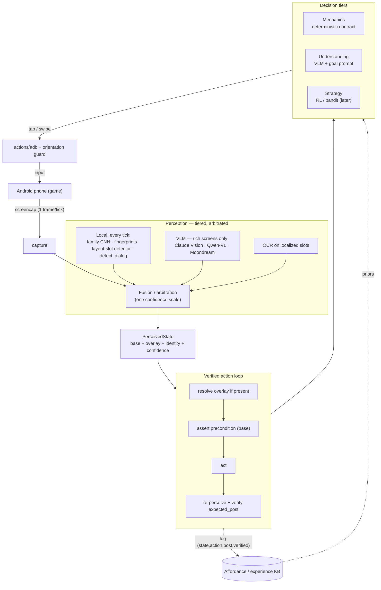

### 1.2 Explore mode vs Play mode (feeding the affordance KB)
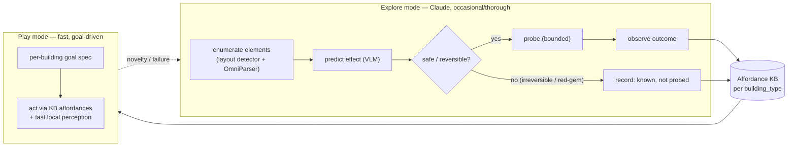

### 1.3 Model tiers & training (distillation)
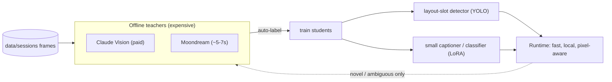

---

## 2. State-machine diagrams

### 2.1 Base navigation states (overlay is a separate, orthogonal axis)
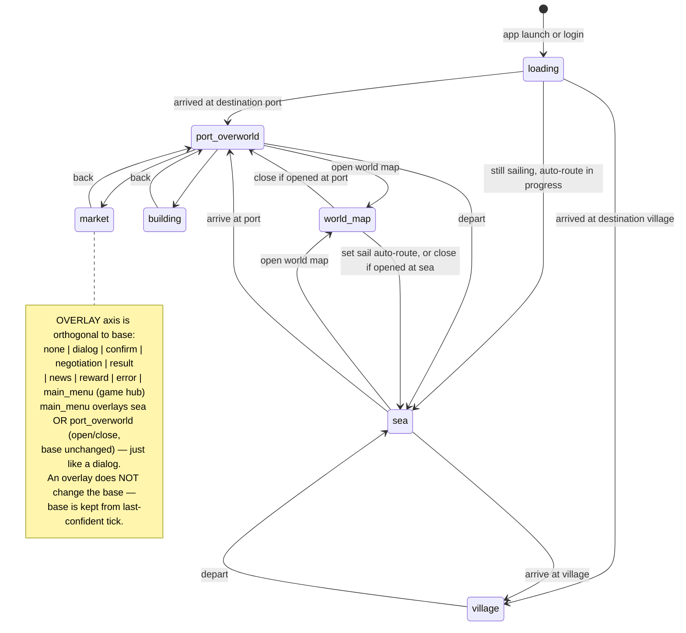

### 2.2 The verified action loop (control state machine)
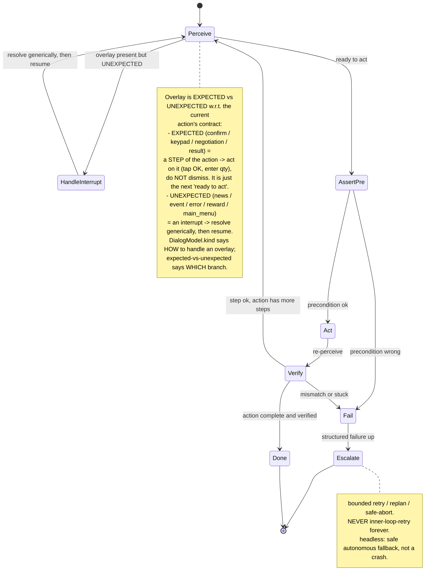

### 2.3 Overlay resolution sub-machine (dialog handling)
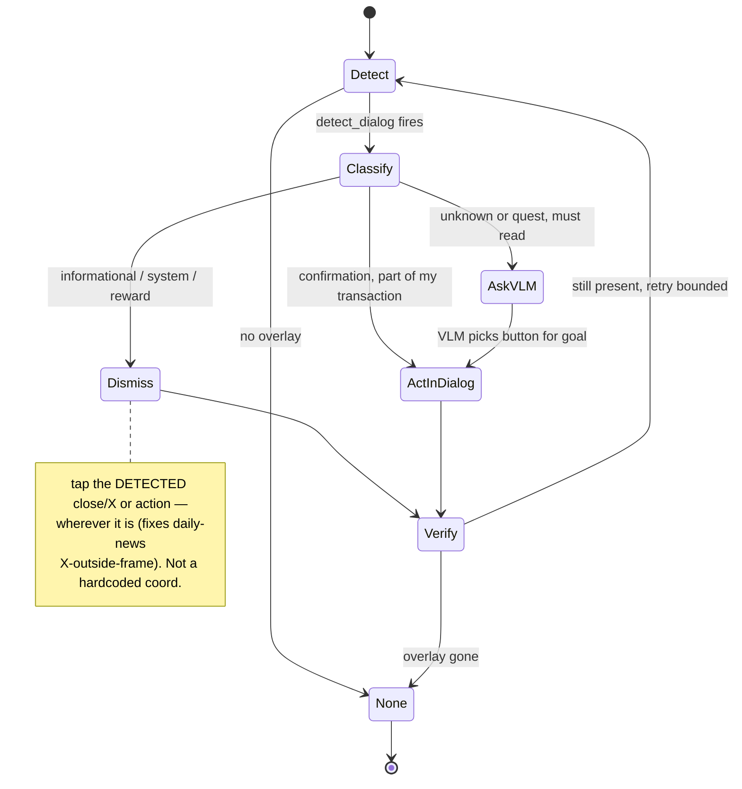

---

## 3. Message sequence charts (key procedures)

### 3.1 One verified action step (the core loop)
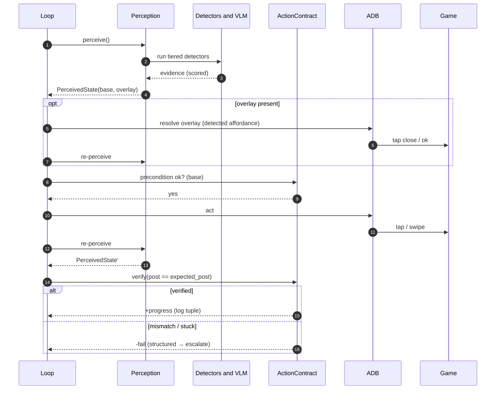

### 3.2 Market buy — Play mode (goal-driven)
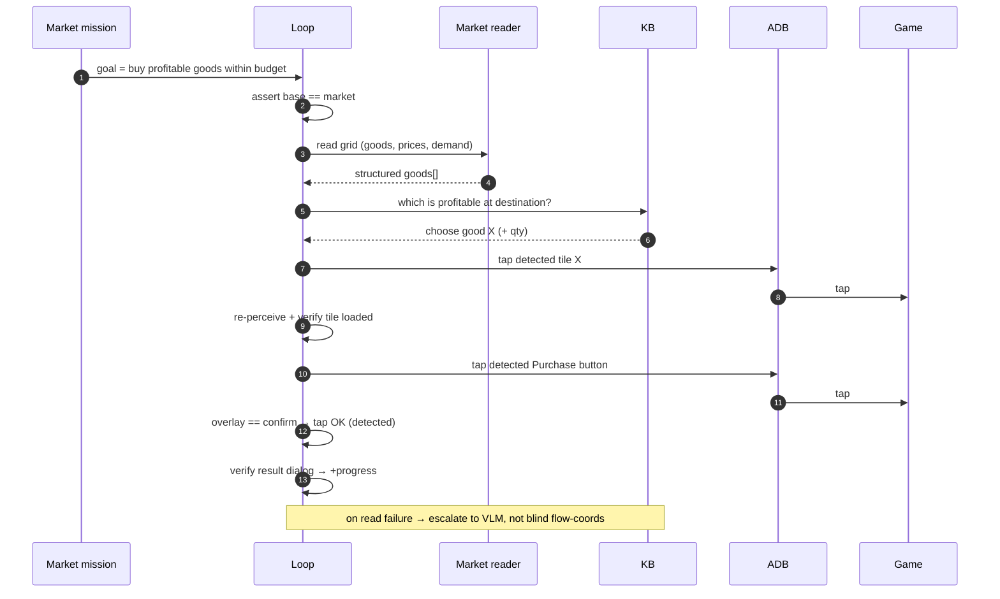

### 3.3 Dialog / overlay handling (daily-news over the inn)
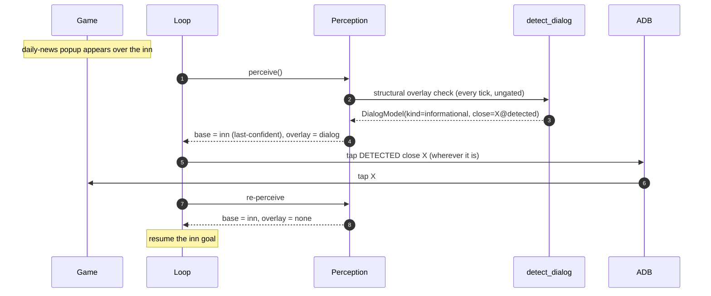

### 3.4 Explore mode — discover the Trade-Point chest affordance
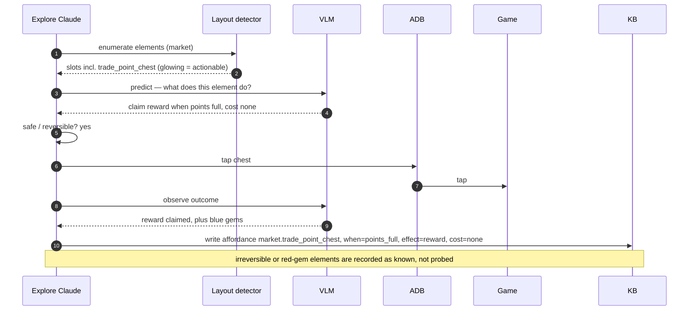

### 3.5 Grow trade-round (orchestration, incl. failure escalation)
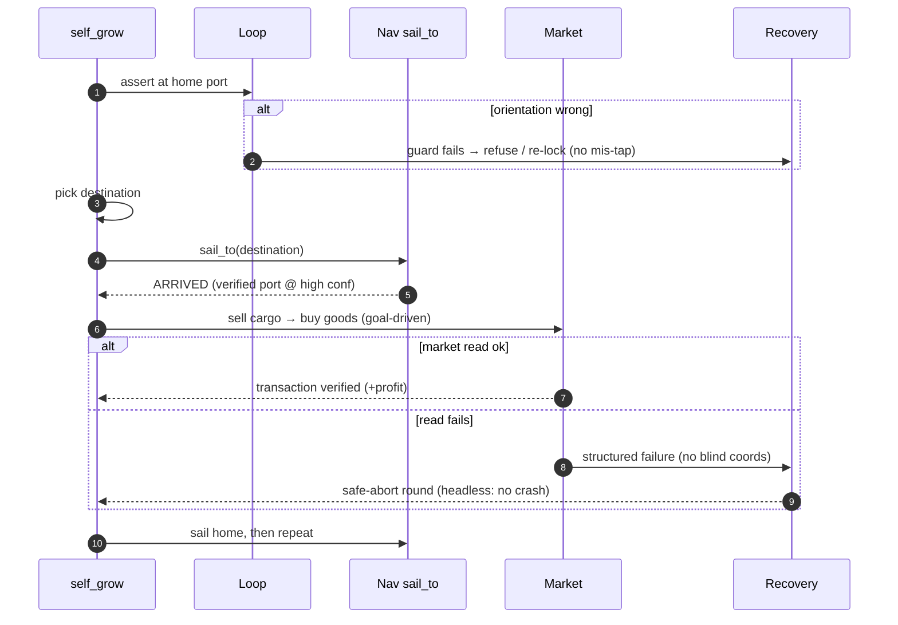

---

## Cross-references
- Design + decisions: `docs/refactor_plan_perceive_flow_fsm.md`
- Findings behind the design: `docs/architecture_review_perceive_flows_2026-08.md`
